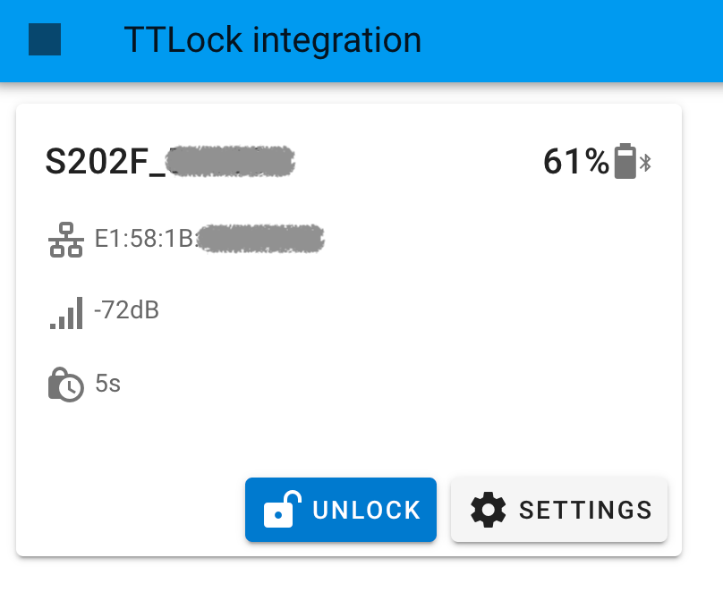
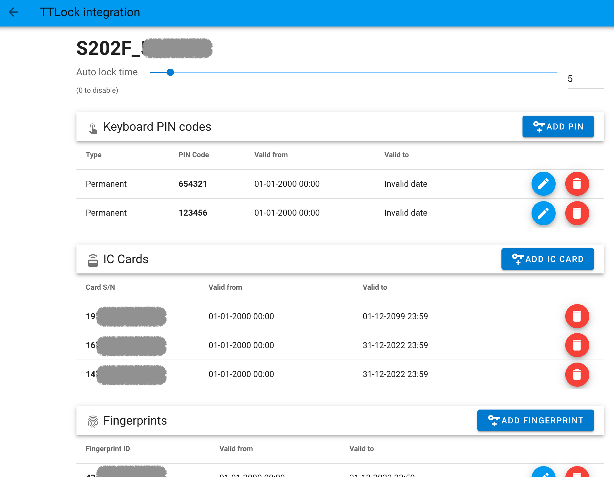
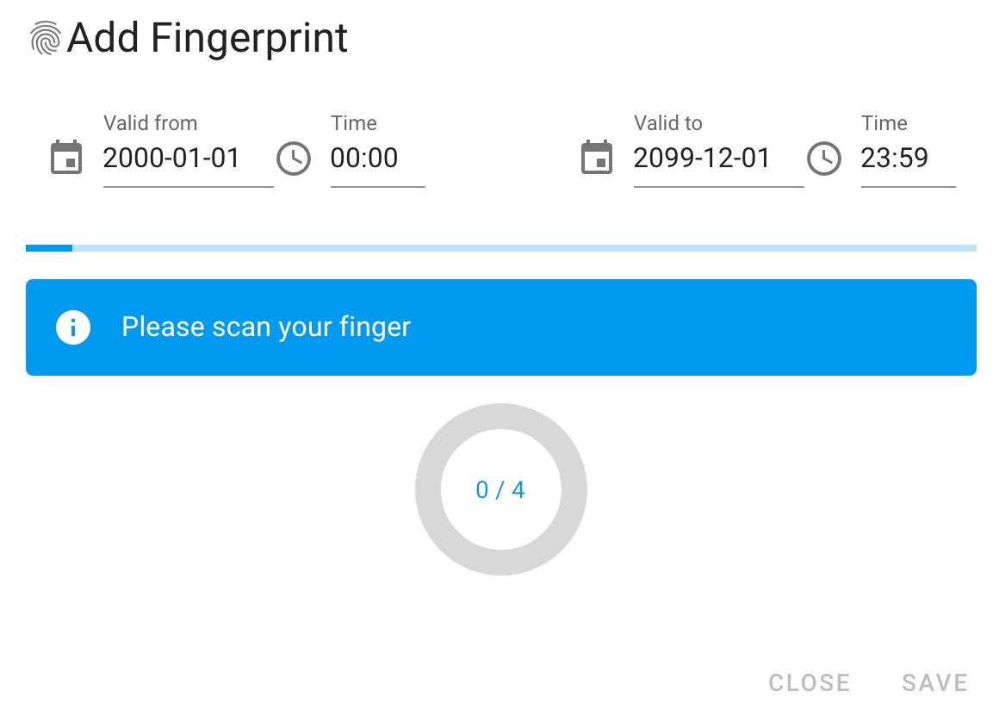
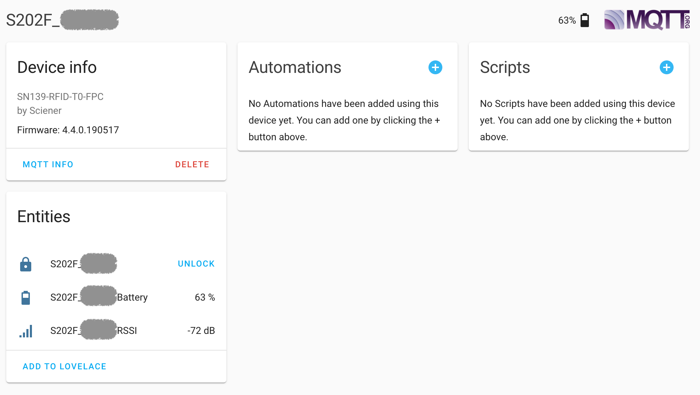

# Home Assistant Add-on TTLock

> This is a **WORK IN PROGRESS**. Help with testing and report bugs [here](https://github.com/kind3r/hass-addons/issues).

## Requirements
- Bluetooth adapter compatible with [@abandonware/noble](https://github.com/abandonware/noble)
- MQTT broker (optional)

## Features
- Ingress Web UI for
  - Pair new lock
  - Lock / unlock
  - Add / edit PIN codes
  - Add / remove IC Cards
  - Add / remove fingerprints
- (optional) HA reporting and controling via `lock` device using MQTT discovery
  - Signal level
  - Battery level
  - Lock/unlock status

## Screenshots

### Lock list  
  

### Credentials  
  

### Add fingerprint  
  

### HA device
  

## How to use
- Install addon (it will take a while to build the docker image, be patient)
- (optional) Install an MQTT broker addon (such as Mosquitto)
- Open Web UI (from Supervisor -> TTLock or from the sidebar)
- Pair a lock (lock needs to be awake when starting the addon or running a BLE scan manually)
- If you installed the MQTT broker the device should now be visibile as a `lock`

## Known issues
- Low BLE signal (which seems to be the case in general) can lead to
  - sometimes failing to pair the lock (make sure you can reset it to factory defaults)
  - failure to read all credentials
  - failure to discover paired locks at startup
- Unable to edit fingerprint validity inteval
- Cannot set autolock time
- Can't save or edit the locks secret store file in order to migrate to another installation

